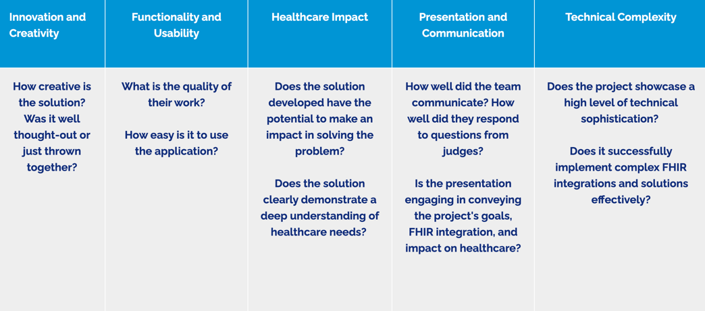

# Team: Vitality
Jason Hertzog's Azalea Health Hackathon Project 2023
- https://knowledge.azaleahealth.com/2023-azalea-hackathon
- https://dev.azaleahealth.com/overview/start#:~:text=start%20making%20requests.-,Accessing%20Resources,-To%20access%20FHIR

# Resources
### Python
- https://docs.python.org/3/
### Flask
- https://flask.palletsprojects.com/en/3.0.x/api/
### FHIR
- https://pypi.org/project/fhir.resources/ (https://github.com/nazrulworld/fhir.resources)
- https://www.hl7.org/fhir/
- https://chat-archive.fhir.org/
### SQL
- https://flask-sqlalchemy.palletsprojects.com/en/3.1.x/
- https://docs.sqlalchemy.org/en/20/
- https://www.sqlite.org/docs.html

## Examples

- (Requires Docker, so probably won't use it) https://community.intersystems.com/post/simple-example-fhir-client-python

# Task Board
- https://jasonhertzog.atlassian.net/jira/software/projects/KAN/boards/1